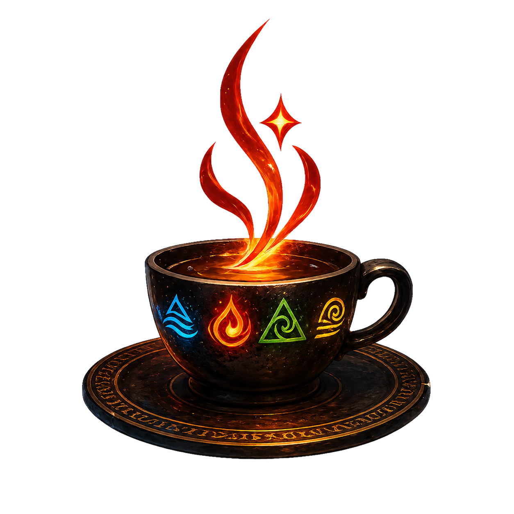
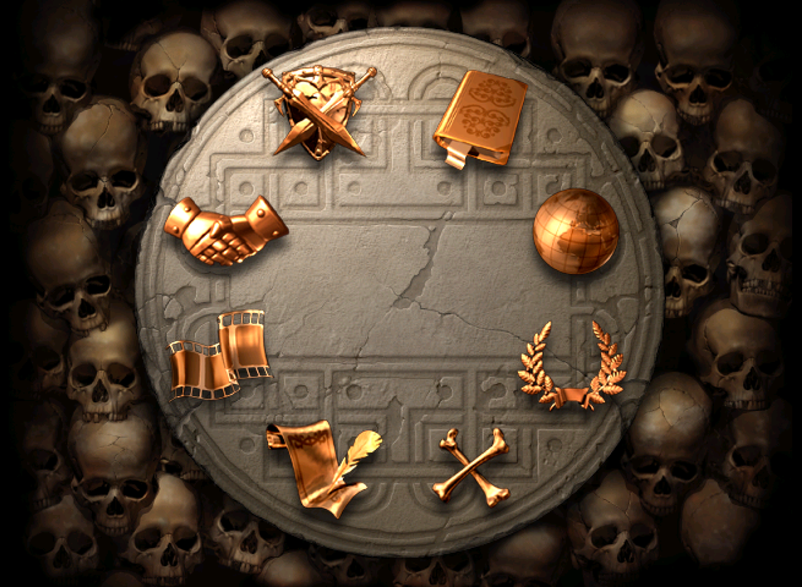
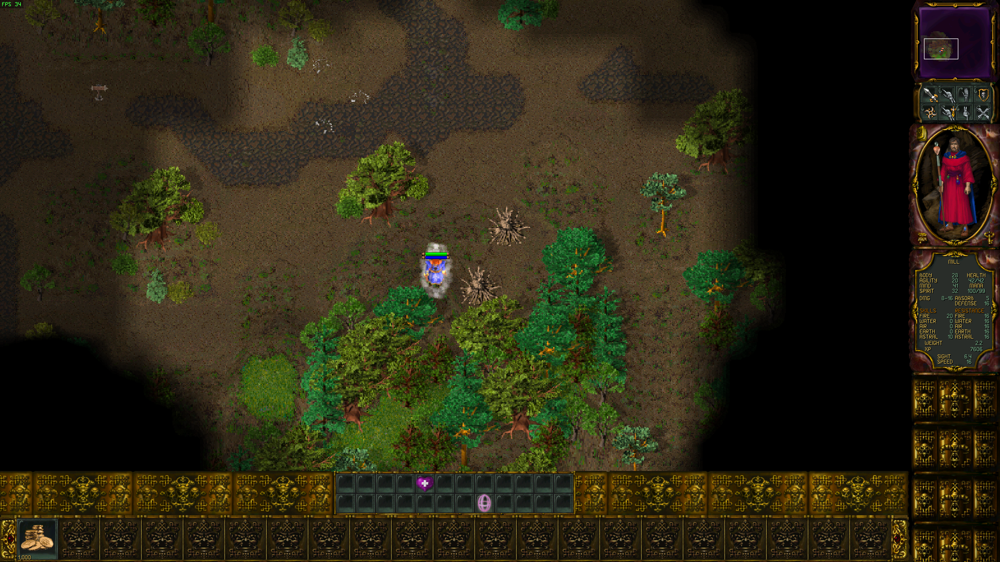
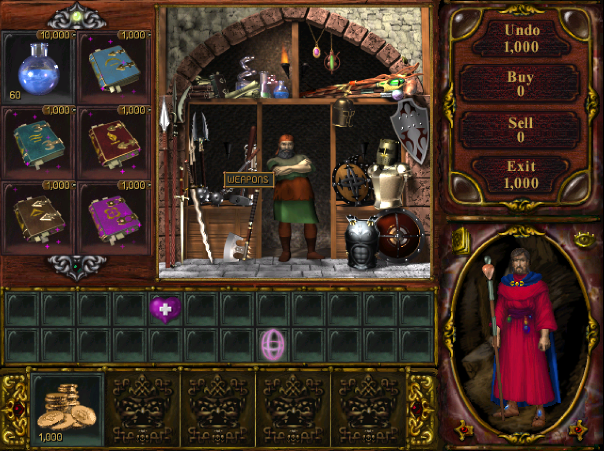
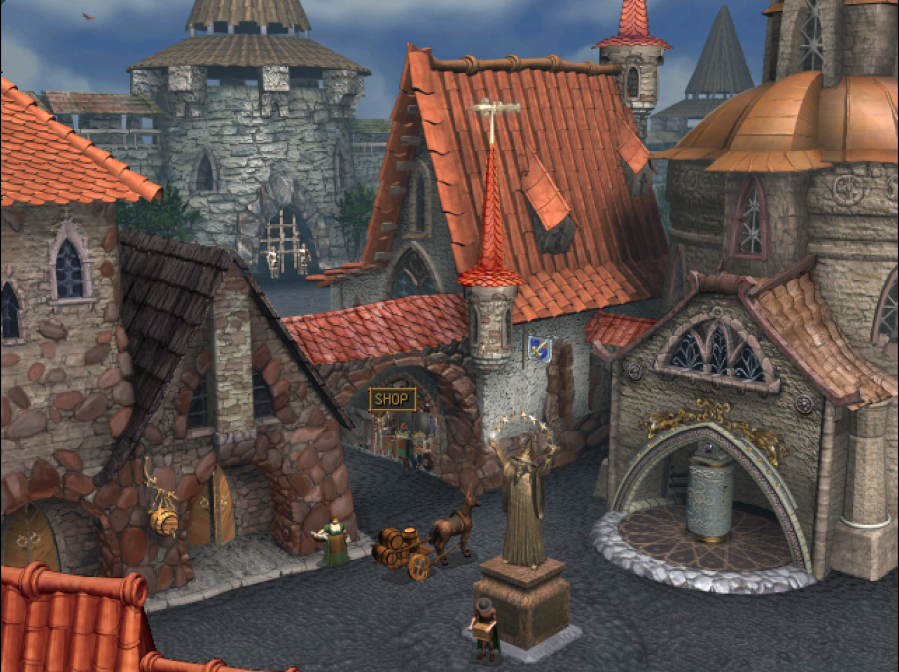
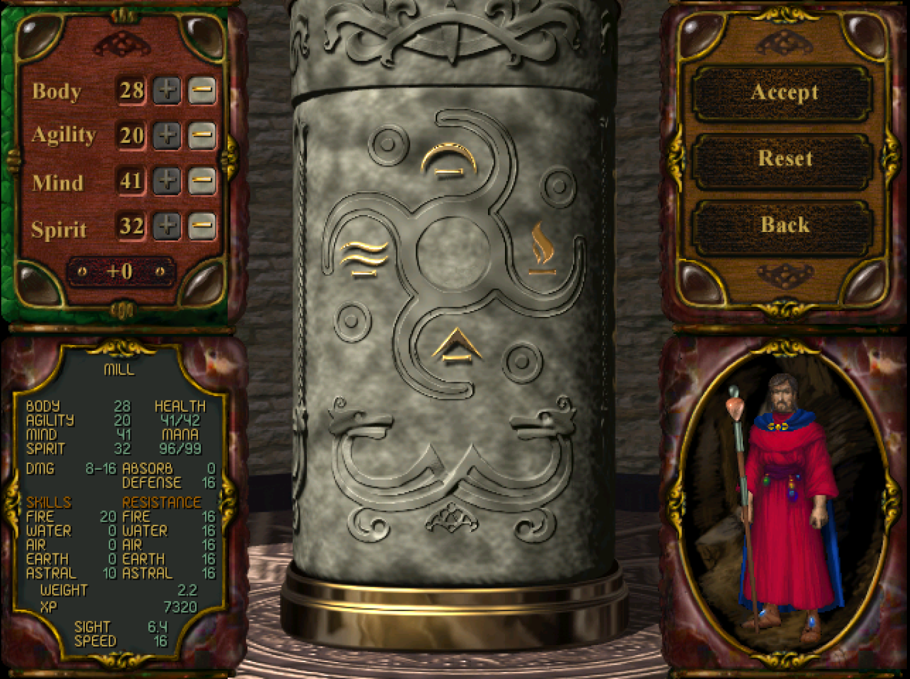
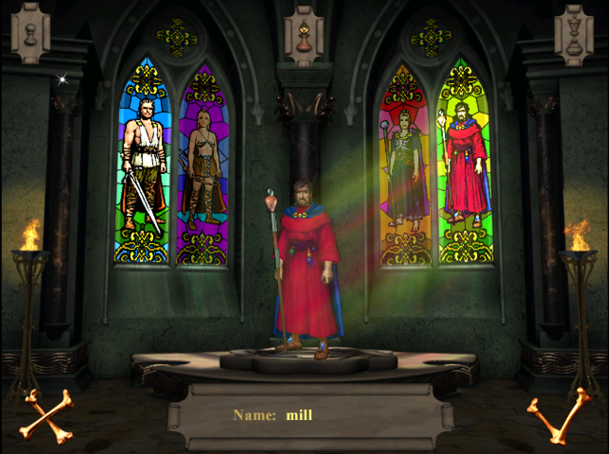

# rom2j

<p align="center">
  
</p>

<p align="center">
  <strong>A work-in-progress Java recovery of the ROM2 / Rage of Mages II runtime.</strong><br />
  Native behavior, original data formats, game UI, networking, and server flow are being rebuilt as a readable Java codebase without sanding away the old engine's shape.
</p>

<p align="center">
  <a href="LICENSE">AGPL-3.0-or-later</a> | Java 25 | LWJGL/OpenGL client | Dedicated server | MapEditor
</p>

## What this is

`rom2j` is a native-parity porting project for ROM2. It is not a loose remake and not a clean-room redesign. The goal is to recover the old Windows/MFC game engine as Java code that can still speak the same file formats, run the same gameplay data, and expose the same odd but important runtime behavior.

That makes the repository part game runtime, part reverse-engineering notebook, and part preservation tool. Model classes keep native offsets and addresses in comments, tracker docs record parity gaps, and launcher/server code is split only where the modern host platform needs a cleaner boundary.

## Current shape

| Area | Status                                                                                                                                             |
| --- | --- |
| Client runtime | LWJGL/GLFW launcher delegates into the recovered `CMainApp` shell.                                                                                 |
| Rendering and UI | Original-style 2D art, panels, portraits, menus, town/shop screens, selection UI, and in-map presentation are actively being ported and corrected. |
| Data formats | MFC archives, text tables, `.res`, `.reg`, `.alm`, palette, image, sound, save, and scenario structures are modeled in Java.                       |
| Multiplayer/server | Raw TCP/IP and dedicated-server paths exist, including a no-GL Swing operator surface.                                                  |
| HAT helper | A simple HAT-compatible HTTP server supports local server-list and discovery testing on port 6666. |
| MapEditor | Work-in-progress editor for ROM2 maps |
| Parity state | Work in progress. Some flows are playable or inspectable; other paths are WIP until native behavior is fully matched.                              |

## Why it is interesting

The project keeps the engine's original constraints visible. Data structures are not flattened into generic DTOs, game actions keep native-compatible packet layouts, and UI work follows the actual visual object/message flow. That gives future fixes a hard target: if Java diverges from native behavior, the difference can be traced, documented, and corrected instead of hidden behind a modern abstraction.

The result is a codebase that can be used to study the game, debug old content, restore dedicated hosting, and gradually make the runtime more portable while preserving the identity of the original engine.

## Entry points

| Purpose | Entry point / doc |
| --- | --- |
| Game client | `ua.millfreedom.rom2.starter.Rom2StarterLWJGL` |
| Dedicated server | `ua.millfreedom.rom2.starter.DedicatedServerStarter` |
| Simple HAT server | `ua.millfreedom.rom2.hatserver.HatHttpServer` |
| MapEditor | `ua.millfreedom.rom2.starter.MapEditorStarter` |

Use the project root as the working directory because the runtime expects the original resource layout beside the code.

<details>
<summary>Screenshots</summary>

| Startup/menu art | In-game wilderness viewport |
| --- | --- |
|  |  |

| Shop and inventory | Town navigation scene |
| --- | --- |
|  |  |

| Character stats | Character creation |
| --- | --- |
|  |  |

</details>

## How to Run the Game

### 1. Prerequisites

1. **Java 25**

   Download and install for your OS.

   Examples:

    * https://www.graalvm.org/downloads/
    * https://www.oracle.com/java/technologies/downloads/#java25

2. **Apache Maven**

   Follow the installation instructions for your OS:

    * https://maven.apache.org/install.html

3. **Git**

   Follow the installation instructions for your OS:

    * https://git-scm.com/install/

### 2. Get and Build

From the terminal of your choice, run the following commands:

```bash
git clone --depth 1 https://github.com/millfreedom/rom2j.git
cd rom2j
mvn clean package
```

### 3. Copy Resources

Create a `res` directory inside the `rom2j` folder, copy everything from the normal client (GOG/CD) into it.

### 4. Run

**Windows / Linux**

```bash
java -jar ./target/rom2nxt-1.0-SNAPSHOT.jar
```

**MacOS**

```bash
java -XstartOnFirstThread -jar ./target/rom2nxt-1.0-SNAPSHOT.jar
```

## License

`rom2j` is licensed under the GNU Affero General Public License v3.0 or later. See [LICENSE](LICENSE).

Unless a file says otherwise, project-authored source and documentation are covered by that license.
Original game data, trademarks, and media compatibility material are not relicensed by this project notice.
